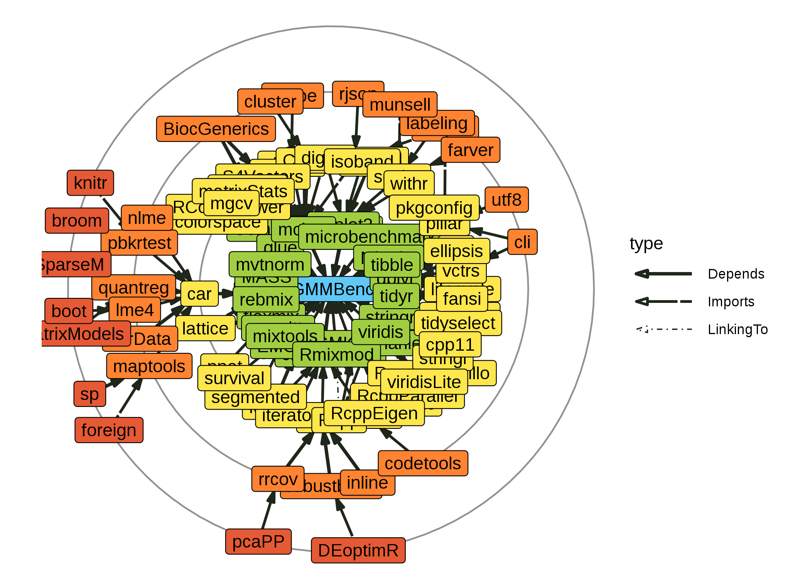

## RGMMBench (0.0.0.9000)

101 recursive dependencies: backports, bgmm, BiocGenerics, BMA, boot,
broom, Cairo, car, carData, circlize, cli, clue, cluster, clustvarsel,
codetools, colorspace, ComplexHeatmap, cpp11, crayon, DCEM, DEoptimR,
digest, dplyr, egg, ellipsis, EMCluster, evaluate, fansi, farver,
flexmix, foreach, foreign, generics, GetoptLong, ggplot2, glue,
GMKMcharlie, gtable, highr, inline, IRanges, isoband, iterators, knitr,
labeling, lattice, lifecycle, lme4, magrittr, maptools, MASS, Matrix,
matrixcalc, MatrixModels, matrixStats, mclust, mgcv, microbenchmark,
MixSim, mixtools, munsell, mvtnorm, nlme, nnet, pbkrtest, pcaPP, pillar,
pkgconfig, png, quantreg, R6, RColorBrewer, Rcpp, RcppArmadillo,
RcppEigen, RcppParallel, rebmix, rjson, rlang, Rmixmod, robustbase,
rrcov, S4Vectors, scales, segmented, shape, sp, SparseM, stringi,
stringr, survival, tibble, tidyr, tidyselect, utf8, vctrs, viridis,
viridisLite, withr, xfun, and yaml.
